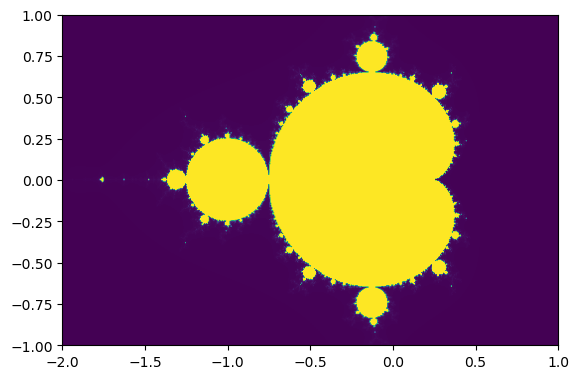
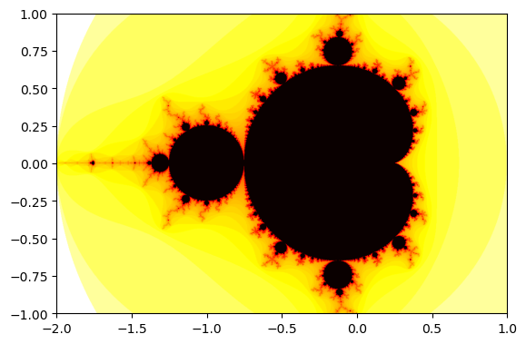

# Mandelbrot Set

The Mandelbrot set $M$ is defined by a uncountable set of complex quadratic polynomials,
$$  f(z) = z^2 + z_0 $$
, where the sample point  $z_0$ is a complex parameter.  
For each $z_0$, the sequence is obtained by iterating at each $z_0$, i.e.
$$ (f(0), f(f(0)), f(f(f(0))), \dots) = (z_0, z_0^2+z_0, z_0^4+2z_0^2+z_0^2+z_0, \dots)$$  
The Mandelbrot set is defined such that the sequene is **bounded** and does not escape to infinity. This conditions constrained that the largeste complex number in the Mandelbrot set is $z_0 = -2$, i.e. the threshold for divergence, or equivalently, 
$$  |z_n| \leq 2, \quad\forall n \geq 0.$$

## Visualization with Density Plot
For density with $\text{Re}(z_0)$ on $x$-axis and $\text{Im}(z_0)$ on $y$-axis, such that 
$$ |z| = \sqrt{\text{Re}(z_0)^2 + \text{Im}(z_0)^2} $$  
The steps to visualization is as follows
1. Define the 1D Mandelbrot Set function `Mand(z0, max_steps)`.
2. Define the 2D function `Mandelbrot(ext, Nxy, max_steps)` to create a 2D array of points in the complex plane.
3. Show the plot with matplotlib.


### Mand()


```python
from numpy import *
```


```python
def Mand(z0, max_steps):
    z = 0j      # 0j means 0+0i, a complex number
    for itr in range(max_steps):
        if abs(z) > 2:  # Stopping condition
            return itr  # Show count
        z = z*z + z0
    return max_steps
```


```python
# Example
result = Mand(0.5 + 0.5j, 100)
print(result)
```

    5


### Mandelbrot()
1. Initialize the 2D grid with `data`.
2. Nested `for` loop to map all points in complex plane.  
    For both $x$ and $y$, to ensure that each point is evenly spaced, each iterated steps is fractioned by the intervals,
    $$ 
         x = x_\text{min}
            + (x_\text{max}-x_\text{min}) \times \frac{i}{Nxy-1.00} 
    $$
3. Store the x, y value in each point of `data`.


```python
def Mandelbrot(ext, Nxy, max_steps):
    """
    ext[4] is an array of 4 values, [min_x, max_x, min_y, max_y]
    Nxy is an int for number of points in x or y of the matrix
    max_steps is inputed into Mand()
    """
    data = zeros((Nxy, Nxy))  # initialize 2D array with tuple (int,int)
    for i in range(Nxy):
        for j in range(Nxy):
            x = ext[0] + (ext[1]-ext[0]) * i/(Nxy-1.)   # 1. denotes a floating point number
            y = ext[2] + (ext[3]-ext[2]) * j/(Nxy-1.)
            data[i,j] = Mand(x+y*1j, max_steps)
    return data
# data is now a 2D array filled with integers.

```


```python
# Example
data = Mandelbrot([-2,1,-1,1], 500, 1000)
```

### Density Plot
The module `pylab` in `matplotlib` is used to plot the 2D image, basically combining both numpy and matplotlib.pyplot in one namespace.  
    
(Optional) To ensure the plot is displayed inline , we can use the magic command `%matplotlib inline`. 


```python
from pylab import *    # plotting library
%matplotlib inline

ext=[-2,1,-1,1]
# pylab's function for displaying 2D image
imshow(transpose(data), extent=ext)  
show()
```


    

    


### Time
To increase Nxy to 1000 would take a long time, we can use `time` to see how long it takes.


```python
import time
t0 = time.time()
data = Mandelbrot([-2,1,-1,1], 1000, 1000)
t1 = time.time()
print('clock timed: ', t1-t0, 's.')
```

    clock timed:  44.41298699378967 s.


### Numba
The package `numba` is used to translate numpy into fast machine code to speed up the process. Numba’s JIT decorators, `@jit`, stands for "just-in-time" compilation for the python code to run at native machine code speed.  
  
We will repeat the 2 functions above but with `@njit`, an alias for `@jit(nopython=True)`, this time.


```python
from numpy import * # because arrays are defined in numpy
from numba import njit  # This is the new line with numba

@njit   # this is an alias for @jit(nopython=True)
def Mand(z0, max_steps):
    z = 0j  # no need to specify type. 
    # To initialize to complex number, just assign 0j==i*0
    for itr in range(max_steps):
        if abs(z)>2:
            return itr
        z = z*z + z0
    return max_steps

@njit
def Mandelbrot2(ext, Nxy, max_steps):
    """
    ext[4]    -- array of 4 values [min_x,max_x,min_y,max_y]
    Nxy       -- int number of points in x and y direction
    max_steps -- how many steps we will try at most before we conclude the point is in the set
    """
    data = zeros((Nxy,Nxy)) # initialize a 2D dynamic array
    for i in range(Nxy):
        for j in range(Nxy):
            x = ext[0] + (ext[1]-ext[0])*i/(Nxy-1.)
            y = ext[2] + (ext[3]-ext[2])*j/(Nxy-1.)
            # creating complex number of the fly
            data[i,j] = Mand(x + y*1j, max_steps)  
    return data
# data now contains integers. 
# MandelbrotSet has value 1000, and points not in the set have value <1000.

```


```python
import time            # timeing
t0 = time.time()
data = Mandelbrot2(array([-2,1,-1,1]), 1000, 1000)
t1 = time.time()
print ('clock timed: ',t1-t0,'s')
```

    clock timed:  4.229031085968018 s


It is around twice as fast using `numba`.

We can further speed up by using the following techniques:  
1. **Pre-allocated arrays** outside the functions to avoids dynamic memory allocation during the computation.
2. `@njit(parallel=True)`: Numba (nopython) with parallelization.
3. **Parallelization with prange** for only the inner loop (j) to  distributes work across multiple CPU cores for faster execution.
4. **Avoiding type checking**: Numba eliminates Python's runtime type-checking overhead.


```python
from numpy import * # because arrays are defined in numpy
from numba import njit  # This is the new line with numba
from numba import prange

@njit   # this is an alias for @jit(nopython=True)
def Mand(z0, max_steps):
    z = 0j  # no need to specify type. 
    # To initialize to complex number, just assign 0j==i*0
    for itr in range(max_steps):
        if abs(z)>2:
            return itr
        z = z*z + z0
    return max_steps

@njit(parallel=True)
def Mandelbrot3(data, ext, max_steps):
    """
    ext[4]    -- array of 4 values [min_x,max_x,min_y,max_y]
    Nxy       -- int number of points in x and y direction
    max_steps -- how many steps we will try at most before we conclude the point is in the set
    """
    Nx,Ny = shape(data) # 2D array should be already allocated we get its size
    for i in range(Nx):
        for j in prange(Ny):    # note that we used prange instead of range.
                                # this switches off parallelization of this loop, so that
                                # only the outside loop over i is parallelized.
            x = ext[0] + (ext[1]-ext[0])*i/(Nx-1.)
            y = ext[2] + (ext[3]-ext[2])*j/(Ny-1.)
            # creating complex number of the fly
            data[i,j] = Mand(x + y*1j, max_steps)  
# data now contains integers. 
# MandelbrotSet has value 1000, and points not in the set have value <1000.
```


```python
import time            # timeing
data = zeros((1000,1000))
t0 = time.time()
Mandelbrot3(data, array([-2,1,-1,1]), 1000)
t1 = time.time()
print ('clock timed: ',t1-t0,'s')
```

    clock timed:  2.2649178504943848 s


### Density Logplot
We can use the the negative logarithm so that the Mandelbrot set has the smallest value. The logarithm enhances contrast by compressing large values (e.g., escape times) into a smaller range.  
  
To use a different color map, use `matplotlib.cm`. 


```python
import matplotlib.cm as cm

# data.T is the transpose function
imshow(-log(data.T), extent=[-2,1,-1,1], cmap=cm.hot)  
show()
```


    

    


# Interactive Mandelbrot Set
1. **Get the New View Area**: It retrieves the current visible bounds of the axes `(xstart, xend, ystart, yend)`.
2. **Recompute Mandelbrot Data**: It calls `Mandelbrot3()` to recalculate the fractal data for the new visible area.
3. **Update the Image**:
    Updates the image with the new fractal data `(-log(data.T))`.
    Adjusts the image's extent to match the visible area.
4. **Redraw the Plot**: It redraws the figure to display the updated fractal.


```python
def ax_update(ax):  # actual plotting routine
    ax.set_autoscale_on(False) # Otherwise, infinite loop
    # Get the range for the new area
    xstart, ystart, xdelta, ydelta = ax.viewLim.bounds
    xend = xstart + xdelta
    yend = ystart + ydelta
    ext=array([xstart,xend,ystart,yend])
    Mandelbrot3(data, ext, 1000) # actually producing new fractal
    
    # Update the image object with our new data and extent
    im = ax.images[-1]  # take the latest object
    im.set_data(-log(data.T))   # update it with new data
    im.set_extent(ext)           # change the extent
    ax.figure.canvas.draw_idle() # finally redraw
```

To allow interactive window to show up from Jupyter Notebook in VScode, we have to change the matplotlib backend to `qt` and the interactive backend will become `qtagg`. 


```python
import matplotlib
%matplotlib qt
import matplotlib.pyplot as plt
print(matplotlib.get_backend())
```

    qtagg


```python
data = zeros((1000,1000))
ext=[-2,1,-1,1]
Mandelbrot3(data, array(ext), 1000)

fig,ax = plt.subplots(1,1)
ax.imshow(-log(data.T), extent=ext, aspect='equal',origin='lower',cmap=cm.hot)

ax.callbacks.connect('xlim_changed', ax_update)
ax.callbacks.connect('ylim_changed', ax_update)
plt.show()
```

In a separate file `mandelbrot.py`, you can run the script simply with `python mandelbrot.py` with terminal in the appropriate enviroment.


